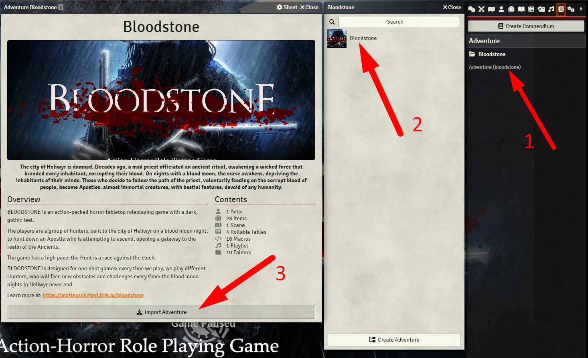

# Bloodstone - Action-Horror mini Forged in the Dark
The city of Heliwyr is damned. Decades ago, a mad priest officiated an ancient ritual, awakening a wicked force that branded every inhabitant, corrupting their blood. On nights with a blood moon, the curse awakens, depriving the inhabitants of their minds. Those who decide to follow the path of the priest, voluntarily feeding on the corrupt blood of people, become Apostles: almost immortal creatures, with bestial features, devoid of any humanity.

BLOODSTONE is an action-packed horror tabletop roleplaying game with a dark, gothic feel.
The players are a group of hunters, sent to the city of Heliwyr on a blood moon night, to hunt down an Apostle who is attempting to ascend, opening a gateway to the realm of the Ancients. 

The game has a high pace: the Hunt is a race against the clock. 
BLOODSTONE is designed for one-shot games: every time we play, we play different Hunters, who will face new obstacles and challenges every time: the blood moon nights in Heliwyr never end.

<table>
<thead>
  <tr>
    <th>
      

        
      

    </th>
  </tr>
</thead>
</table>

# Documentation
You need **Simple Worldbuilding System** to use this module.

You also need **Forged in the Dark Roller**.

You need the [PDF](https://matteosciutteri.itch.io/bloodstone) to play.

After have everything create a world, activate the modules. 

You now can import a Actor Sheet model and gear and other items. **Check the compendiums.** 

<table>
<thead>
  <tr>
    <th>
      

        
      

    </th>
  </tr>
</thead>
</table>

There is journal **Read Me** with more instructions. 

# Installation

## Installation
Search **Bloodstone** at Foundry VTT modules.

## Manual Installation
Manifest: https://raw.githubusercontent.com/brunocalado/bloodstone/main/module.json

# About
If you want to learn about this game go to [Bloodstone](https://matteosciutteri.itch.io/bloodstone) and get the PDFs.

# Changelog
Learn about changes at [CHANGELOG](CHANGELOG.md).

# License
This work is based on Blades in the Dark, product of One Seven Design, developed and authored by John Harper, and licensed for our use under the Creative Commons Attribution 3.0 Unported license.

You can also check the license reading the comments at: [Bloodstone](https://matteosciutteri.itch.io/bloodstone). I requested permission in there.

If I add any code it'll be under [LICENSE](LICENSE).

# Assets
- Oath - PTBT -> Oath of Hunter - Bloodstone © 2022 by Mestre Digital is licensed under CC BY-SA 4.0
- clock skull -> https://pixabay.com/service/license/
- clocks -> Some assets were taken from here (thank you timdenee and joesinghaus): https://github.com/joesinghaus/Blades-in-the-Dark

# Mestre Digital
About this module creator: https://sites.google.com/view/mestredigitalmodules